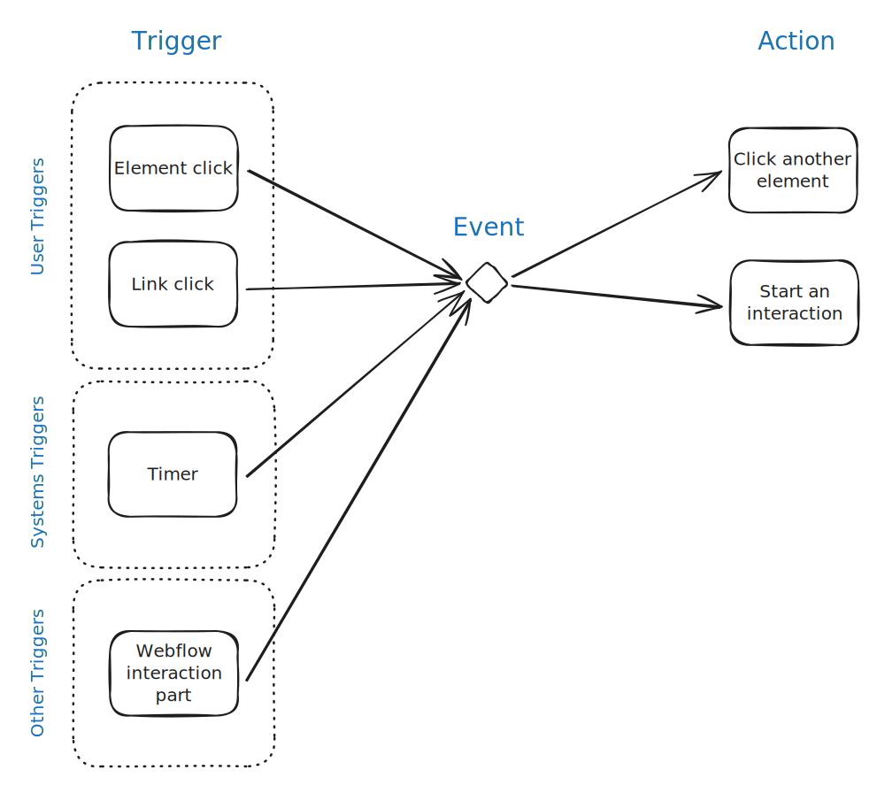

# Kiosk Base 🧪



**EXPERIMENTAL** \
Not yet available for public use&#x20;


SA5 Kiosk enables a standard Webflow-hosted site to deliver some or all of its content through a kiosk.&#x20;

Showcase products and services, collect customer feedback and orders all through your same Webflow-hosted site, while the customer is physically in-store at your retail shop or clinic.&#x20;

The primary advantages of this approach is;

* Low cost.  The kiosk setup uses a browser - Chrome is best for our setup, and requires only a cheap PC and touchscreen.&#x20;
* Branding consistency with your website. &#x20;
* Centralized CMS data and ECom products&#x20;

## Overview&#x20;

Base functionality;

* Kiosk detection&#x20;
* Conditional visibility
  * Show kiosk-only elements only when in kiosk mode&#x20;
  * Show browser-only elements only when in browser mode&#x20;

### Kiosk Detection & Kiosk Modes

SA5 Kiosk is designed to work in 3 possible modes;&#x20;

| Mode                                      | Description                    | Notes                                                                                                   |
| ----------------------------------------- | ------------------------------ | ------------------------------------------------------------------------------------------------------- |
| Browser mode                              | Default, normal-website mode.  | <ul><li>Website operates as normal</li><li>Any kiosk-only elements are hidden </li></ul>                |
| Kiosk mode                                | Kiosk-specific mode            | Triggered by the user-agent string                                                                      |
| <p>Display mode<br>( currently RFC ) </p> | Hands-free display mode        | <p>Triggered by either;</p><ul><li>The user-agent string </li><li>Kiosk mode inactivity timer</li></ul> |



## Conditional Visibility&#x20;

Elements


* Kiosk detection&#x20;
* Conditional visibility
  * Show kiosk-only elements only when in kiosk mode&#x20;
  * Show browser-only elements only when in browser mode&#x20;


* Use Chrome in `--kiosk` mode
* Set a user agent to identify it to scripts&#x20;
* Support conditional visibility based on that state &#x20;


## Advanced Discussions

Although it's generally not necessary, it's possible to implement conditional visibility at a reverse proxy level to ensure the best SEO.&#x20;


```
document.addEventListener("DOMContentLoaded", () => {
    // Function to check for kiosk mode
    function isKioskMode() {
        return /kiosk/i.test(navigator.userAgent); // Case-insensitive check for "kiosk" in the user agent string
    }

    // Log kiosk mode and the result of the isKioskMode function
    const kioskMode = isKioskMode();
    console.log("Kiosk Mode:", kioskMode);

    // Handle elements with kiosk-mode attributes based on the kioskMode flag
    if (kioskMode) {
        // Remove the "kiosk-mode=show" attribute if in kiosk mode
        const showElements = document.querySelectorAll('.kiosk-show');
        showElements.forEach(element => {
            element.classList.remove("kiosk-show");
        });
    } else {
        // Remove the "kiosk-mode=hide" attribute if not in kiosk mode
        const hideElements = document.querySelectorAll('.kiosk-hide');
        hideElements.forEach(element => {
            element.classList.remove("kiosk-hide");
        });
    }

    // Select all <data> elements with action="add-query"
    const dataElements = document.querySelectorAll('data[action="add-query"]');

    dataElements.forEach(dataElement => {
        // Extract the param and value attributes
        const param = dataElement.getAttribute("param");
        const value = dataElement.getAttribute("value");

        if (param && value) {
            // Find the nearest parent link element containing the <data> element
            let parentLink = dataElement.closest("a");

            if (parentLink) {
                // Parse the existing URL
                const url = new URL(parentLink.href);

                // Add the new query parameter
                url.searchParams.set(param, value);

                // Update the link's href
                parentLink.href = url.toString();
            }
        }
    });
});

```

