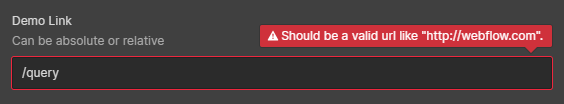

# YouTube Hide Related Videos \[BETA] ❺


**BETA note**\
While this version works perfectly in our testing, we have reason to believe there is an underlying race condition occurring with the YouTube player lib. If you encounter any unexpected behaviors, please let us know in the forum ( link at top ).&#x20;


When an embedded YouTube video is paused or finished playing, a series of "related videos." are shown. These often detract from your Webflow site's elegant design, and by default they can show unrelated or even a competitor's videos.

It's not ideal...&#x20;

<figure><figcaption></figcaption></figure>

This SA5 attribute blocks the play and stop views with an overlay that can make this UX more elegant. At this point it is very simple.

| Video paused overlay                        | Video finished overlay                      |
| ------------------------------------------- | ------------------------------------------- |
| .png>) | .png>) |


It is possible to change the color and the icon however it requires knowledge of CSS. See our [Styling Options](styling-options.md) for details.&#x20;


## Usage Notes 


Currently this feature works with **Webflow's YouTube video element** specifically. Make sure you are using the right one.&#x20;

.png>)


Simply add a custom attribute of `wfu-youtube-norel` to any YouTube video on your page.&#x20;

## Getting Started ( NOCODE ) 

### STEP 1 - Add the Library 

First, **add the library** as detailed in [Quick Start](../quick-start.md).&#x20;

### STEP 2 - Apply `wfu-youtube-norel` to any YouTube Player Elements you want it to affect 

See above for details.

\
