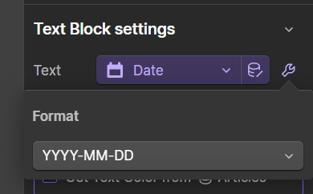

# SA5 Data ❺🧪


**BETA TESTING**

This library is in beta testing.&#x20;


**SA5 Structured Data** is a special `<script>` code block format that is designed to easily capture CMS and static data, and encode it in a JavaScript object. It is designed to model the core capabilities of the JSON format, but in a way that is easier to use in Webflow and which correctly handles Webflow's embed field encoding.&#x20;

This makes it easy to work with in our client side code and create data sources, drive business logic, or to create JSON-LD.&#x20;

## BETA Testing Notes <a href="#display-captions-in-webflows-lightboxes" id="display-captions-in-webflows-lightboxes"></a>

**SA5 Data** is in open BETA. We're doing some final design work around typed values, nulls, and whitespace handling.&#x20;

To mitigate any further changes we'll release the BETA format under a separate BETA type specifier;&#x20;

```html
<script type="sygnal/sa5-data-proto">
```

Things we may change or add future support for;

* Path to strongly typed values, **int**, **boolean**, and **null**
* Handling of **nulls** v. identification of an object start tag
* Testing whitespace around key, and value, and delimiter
* Allowing for delimiter value-type attributes, + ? :: $
* Docs and language around multiline literals&#x20;

## How Does it Work? <a href="#display-captions-in-webflows-lightboxes" id="display-captions-in-webflows-lightboxes"></a>

Here's a very simple example of what SA5 Data looks like.&#x20;

```html
<script type="sygnal/sa5-data">
name: John Doe
slug: john-doe
brief: Software Engineer
</script>
```

This would be parsed as the JavaScript object;&#x20;

```json
{
  "name": "John Doe",
  "slug": "john-doe",
  "brief": "Software Engineer"
}
```

In a Webflow HTML Embed, an example might look like this;

<figure><figcaption></figcaption></figure>

### Nested Objects

Objects can be nested by specifying the object key on one line, and indenting the nested object beneath it;&#x20;

```html
<script type="sygnal/sa5-data">
@context: http://schema.org
@type: Person
name: John Doe
jobTitle: Software Engineer
address:
    @type: PostalAddress
    streetAddress: 123 Main St
    addressLocality: Springfield
    addressRegion: IL
    postalCode: 12345
    addressCountry: US
</script>
```

Which is parsed as;&#x20;

```json
{
  "@context": "http://schema.org",
  "@type": "Person",
  "name": "John Doe",
  "jobTitle": "Software Engineer",
  "address": {
    "@type": "PostalAddress",
    "streetAddress": "123 Main St",
    "addressLocality": "Springfield",
    "addressRegion": "IL",
    "postalCode": "12345",
    "addressCountry": "US"
  }
}
```

## Multiline Content

There is an edge case problem here, which is that in Webflow a CMS text field can be set to multiline, and can contain line breaks. To resolve this unambiguously, wrap Webflow's embedded variable in angle brackets `<` `>`

Objects can be nested by specifying the object key on one line, and indenting the nested object beneath it;&#x20;

```html
<script type="sygnal/sa5-data">
name: The Catcher in the Rye
author: J.D. Salinger
description: <In "The Catcher in the Rye," the protagonist, Holden Caulfield, 
recounts his experiences in New York City after being expelled 
from an elite prep school.> 
</script>
```

Which is parsed as;&#x20;


```json
{
  "name": "The Catcher in the Rye",
  "author": "J.D. Salinger",
  "description": "In \"The Catcher in the Rye,\" the protagonist, Holden Caulfield,\nrecounts his experiences in New York City after being expelled\nfrom an elite prep school."
}
```



The use of angle brackets was chosen because Webflow HTML encodes all values it embeds, which means that angle brackets cannot exist in the embedded content itself.&#x20;



Also use angle brackets if whitespace characters at the start or end of your field content are an essential part of your data.&#x20;


## Typed Values&#x20;

By default, values are interpreted as string values, and JavaScript objects are created accordingly. However you can identify any field as a **numeric** or **boolean** type when appropriate.&#x20;

This is done by adding a symbol immediately after the `:` delimiter;

* `:` or `:$` indicate a **string** value
* `:#` indicates a **numeric** value
* `:?` indicates a **boolean** value

Here's an example structure;

```html
<script type="sygnal/sa5-data">
name:$ John Doe
age:# 23
isActive:? true
description: <John is a software engineer
from Springfield. He loves coding and
is passionate about technology.>
</script>
```

## Null Values

Blank values are expressed as `nulls` in your object, regardless of the type.

Here, `age` and `isActive` are **nulls**;&#x20;

```html
<script type="sygnal/sa5-data">
name:$ John Doe
age:# 
isActive:? 
description: <John is a software engineer
from Springfield. He loves coding and
is passionate about technology.>
</script>
```

## Nested Objects

**SA5 Data** also supports nested objects.

To indicate a nested object,&#x20;

1. Place your field key on a line by itself, with a _double-colon_ `::` suffix&#x20;
2. Indent the fields within your nested object beneath it&#x20;

Here `address` and `postalCode` are both nested objects.&#x20;

```html
<script type="sygnal/sa5-data">
name:$ John Doe
age:# 23
isActive:? true
description: <John is a software engineer
from Springfield. He loves coding and
is passionate about technology.>
address::
    street: 
    city: Springfield
    country: 
    postalCode::
        code:# 
        region: 
</script>
```

## Technical Guide

**SA5 Data** is a custom notation designed to represent structured data in a human-readable format. It is designed specifically to work with Webflow's Custom Code areas and HTML Embeds, and to work with Webflow's HTML-encoded CMS field embeds.&#x20;

This syntax combines elements of traditional data representation formats like JSON, YAML and HCL, and simplifies them for ease of use. SA5 Data is particularly suitable for configuration, data representation, and other scenarios where clear, concise data structures are desired.

Design features;

* Is very easy to work with in Webflow's HTML Embed editor
* It reliably handles Webflow's innate HTML encoding in embedded CMS fields
* It handes line breaks in multiline embed content
* It is easily translated directly to JavaScript objects&#x20;


Sygnal designed **SA5 Data** because other approaches like raw JSON embeds created too many risks for broken, unparseable data structures. SA5 Data safely transports HTML Encoded CMS data from Webflow's Collection lists into JavaScript objects with zero risk of data loss, damage, or broken scripts. &#x20;


### Basic Rules <a href="#display-captions-in-webflows-lightboxes" id="display-captions-in-webflows-lightboxes"></a>

**Script Tag:**

* Every SA5 Data block starts with a `<script type="sygnal/`sa5-data`">` tag and ends with a `</script>` tag.

**Key-Value Pairs**:

* Represent data as `key: value` pairs.
* Each pair should be on a new line.
* Whitespace will be trimmed from both the key and the value
* The first colon on the line is a delimiter, thus the key cannot contain a `:` but the value can

**Values**:

* Do not enclose values in quotes. They are not needed and would be considered part of the string content.
* All values must be HTML-encoded. This happens automatically with Webflow's embedded fields. If you have static string content;&#x20;
  * `<` must be encoded as `&lt;`
  * `>` must be encoded as `&gt;`
  * `&` must be encoded as `&amp;`
*   If a value is delimited by `<` and `>` characters, the whitespace and line feeds within those angle brackets are considered part of the value.

    ```plaintext
    multi-line-value: <This is a
    multi-line value with preserved whitespace and line breaks.>
    ```
* Value type defaults to strings, and will be created in the JavaScript object accordingly. However you can also define numeric and boolean types by appending a type identifier to the value separator;
  * `:` or `:$` indicates a **string** value
  * `:#` indicates a **numeric** value
  * `:?` indicates a **boolean** value
* Empty values of any time resolve to `null` values.

**Indentation & Nesting**:

* Nested structures are indicated by indentation.
* Use consistent indentation (preferably spaces) to represent nested structures. The level of indentation indicates the depth of nesting.
* For each nested level, increase the indentation consistently (e.g., by two or four spaces).

**No Commas or Brackets**:

* Unlike JSON, SA5 Data doesn't use commas to separate key-value pairs or brackets to denote objects.

## Technical Notes

In the resulting JavaScript object-

* Value types are all string, unless identified as boolean or numeric &#x20;
* Empty values are always `null`&#x20;
* Webflow's HTML encoded fields are decoded
* Line breaks are encoded as `\n`&#x20;

## Future

As multiline string delimiters, `<` `>` are concise and unambiguous, however we are also considering the use of `"""`, ` ``` ` or `\\\` delimiters to make them more visible.&#x20;


We expect that the need for multiline strings support is relatively low.&#x20;



